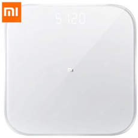

# Xiaomi Mi Scale

Code to read weight measurements from Xiaomi Body Scales.

## Supported Scales:
Name | Model | Picture
-------------------------------------------- | --- | :---:
[Mi Smart Scale 2](https://www.mi.com/global/scale) | XMTZC04HM | 
[Mi Body Composition Scale](https://www.mi.com/global/mi-body-composition-scale/) | XMTZC02HM | 
[Mi Body Composition Scale 2](https://c.mi.com/thread-2289389-1-0.html) | XMTZC05HM | 


## Getting the Mac Address of your Scale:

1. Retrieve the scale's MAC Address using this command:
```
$ sudo hcitool lescan | grep -i MIBCS

LE Scan ...
C4:D3:8C:12:4C:57 MIBCS
[...]
```
1. Note down the MAC address of your scale, we will need to use this as part of your configuration... Depending on your scale it could be one of
	1. `MIBCS`
	1. `MIBFS`
	1. `MI SCALE2`

## Setup & Configuration:
### Running script with Docker:

1. Supported platforms:
	1. linux/amd64
	1. linux/arm32v6
	1. linux/arm32v7
	1. linux/arm64v8
1. Open `docker-compose.yml` (see below) and edit the environment to suit your configuration...
1. Stand up the container - `docker-compose up -d`

### docker-compose:
```yaml
version: '3'
services:

  mi-scale:
    image: lolouk44/xiaomi-mi-scale:latest
    container_name: mi-scale
    restart: always

    network_mode: host
    privileged: true

    environment:
    - MISCALE_MAC=00:00:00:00:00:00 # Mac address of your scale
    - MQTT_HOST=127.0.0.1  # MQTT Server (defaults to 127.0.0.1)
    - MQTT_PREFIX=miScale
    - MQTT_USERNAME=       # Username for MQTT server (comment out if not required)
    - MQTT_PASSWORD=       # Password for MQTT (comment out if not required)
    - MQTT_PORT=           # Defaults to 1883
    - TIME_INTERVAL=30     # Time in sec between each query to the scale, to allow other applications to use the Bluetooth module. Defaults to 30

      # Auto-gender selection/config -- This is used to create the calculations such as BMI, Water/Bone Mass etc...
      # Up to 3 users possible as long as weights do not overlap!

    - USER1_GT=70            # If the weight is greater than this number, we'll assume that we're weighing User #1
    - USER1_SEX=male
    - USER1_NAME=Jo          # Name of the user
    - USER1_HEIGHT=175       # Height (in cm) of the user
    - USER1_DOB=1990-01-01   # DOB (in yyyy-mm-dd format)

    - USER2_LT=35            # If the weight is less than this number, we'll assume that we're weighing User #2
    - USER2_SEX=female
    - USER2_NAME=Serena      # Name of the user
    - USER2_HEIGHT=95        # Height (in cm) of the user
    - USER2_DOB=1990-01-01   # DOB (in yyyy-mm-dd format)

    - USER3_SEX=female
    - USER3_NAME=Missy       # Name of the user
    - USER3_HEIGHT=150       # Height (in cm) of the user
    - USER3_DOB=1990-01-01   # DOB (in yyyy-mm-dd format)
```


### Running script directly on your host system (if your platform is not listed/supported):

**Note: Python 3.6 or higher is required to run the script manually**
1. Install python requirements (pip3 install -r requirements.txt)
1. Open `wrapper.sh` and configure your environment variables to suit your setup.
1. Add a cron-tab entry to wrapper like so:

```sh
@reboot bash /path/to/wrapper.sh
```

**NOTE**: Although once started the script runs continuously, it may take a few seconds for the data to be retrieved, computed and sent via mqtt.

## Home-Assistant Setup:
Under the `sensor` block, enter as many blocks as users configured in your environment variables:

```yaml
  - platform: mqtt
    name: "Example Name Weight"
    state_topic: "miScale/USER_NAME/weight"
    value_template: "{{ value_json['Weight'] }}"
    unit_of_measurement: "kg"
    json_attributes_topic: "miScale/USER_NAME/weight"
    icon: mdi:scale-bathroom

  - platform: mqtt
    name: "Example Name BMI"
    state_topic: "miScale/USER_NAME/weight"
    value_template: "{{ value_json['BMI'] }}"
    icon: mdi:human-pregnant

```


## Acknowledgements:
Thanks to @syssi (https://gist.github.com/syssi/4108a54877406dc231d95514e538bde9) and @prototux (https://github.com/wiecosystem/Bluetooth) for their initial code

Special thanks to [@ned-kelly](https://github.com/ned-kelly) for his help turning a "simple" python script into a fully fledge docker container

Thanks to [@bpaulin](https://github.com/bpaulin) for his PRs and collaboration
